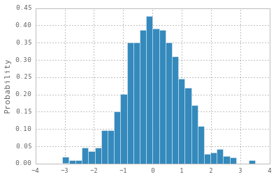
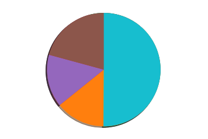
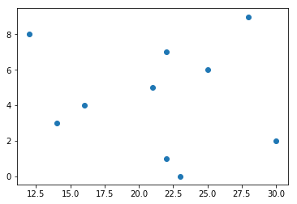
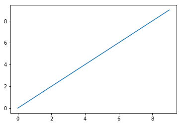

Nowadays, datasets comprise a huge amount of information. We need data visualization to represent the patterns and relationship in data to analyze it.


Given data can be one of the following types:

## Univariate Data
Measurement of a single quantitative variable. It can be represented using:

- __Histogram:__ A histogram is an accurate representation of the distribution of numerical data. It is an estimate of the probability distribution of a continuous variable.

```
#histograms
x = np.random.normal(size = 1000)
plt.hist(x, normed=True, bins=30)
plt.ylabel('Probability')
```



- __Pie Chart:__ A _pie chart_ (or a circle _chart_) is a circular statistical graphic, which is divided into slices to illustrate numerical proportion.
  
```
#pie chart
x=np.random.normal(size=10)
fig=plt.subplot()
fig.pie(x,startangle=90,shadow=True)
fig.axis('equal')
plt.show()
```



## Bivariate Data

Constitutes of paired samples of two quantitative variables.

- Scatter plots:
  
```
#scatter plot
x=np.random.random_integers(30,size=10)
yy=[0,1,2,3,4,5,6,7,8,9]
y=np.array(yy)
fig=plt.subplot()
fig.scatter(x,y)
plt.show()
```



- Line plot:
  
```
#line plot
yy=[0,1,2,3,4,5,6,7,8,9]
x=np.array(yy)
y=np.array(yy)
fig=plt.subplot()
fig.plot(x,y)
plt.show()
```



## Multivariate Data
Multidimensional representation of multivariate data. Can be represented using the following methods:
- Icon-based methods
- Pixel-based methods
- Dynamic parallel coordinate system