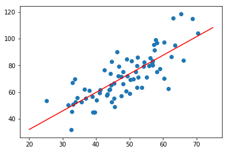

Linear regression is the simplest and most widely used method in machine learning. It is used to predict the correlation between one or more independent variables and dependent variables. It predicts the output by averaging the data. It basically finds a straight line, plane or hyperplane which best fits the data given.

## Types of Linear Regression

- **Single Dimension Linear Regression**

Single Dimension Linear Regression has only one dimension and as input and output data. It contains pairs of x and y as input to the algorithm. The algorithm uses

`y=ax+b`

to train the algorithm and find the value of y. The training samples are used to derive the values of a and b that minimizes the error between the actual and predicted value of y.

- **Multi-Dimension Linear Regression**

In multi-dimension linear regression, each training sample has x made up of multiple input values for a corresponding y. Input basically is a matrix in which each row is sample and each column is a dimension. The output can be represented as y matrix with only one column and each row is the output corresponding to each input. Predicted value y is predicted by

`y=Xw`

where X is the input matrix and is a matrix of weight. If there are two dimensions then equation defines the plane and if there are more dimensions then it is a hyperplane.
