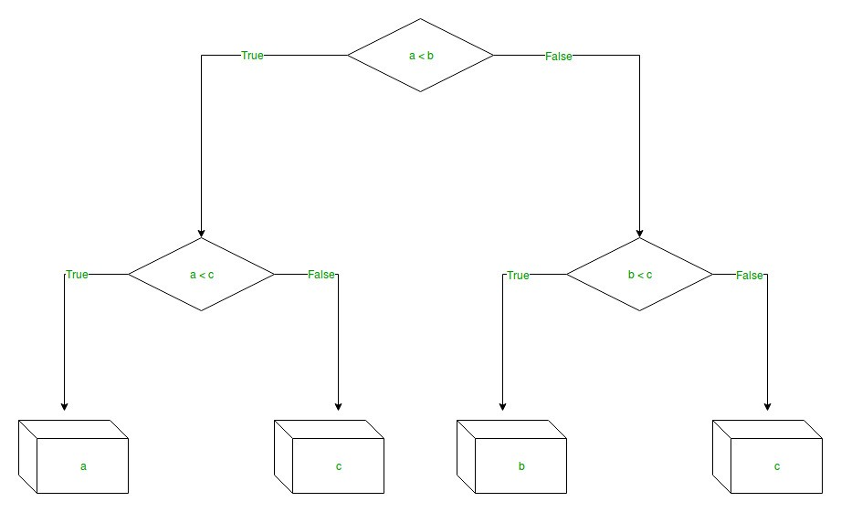
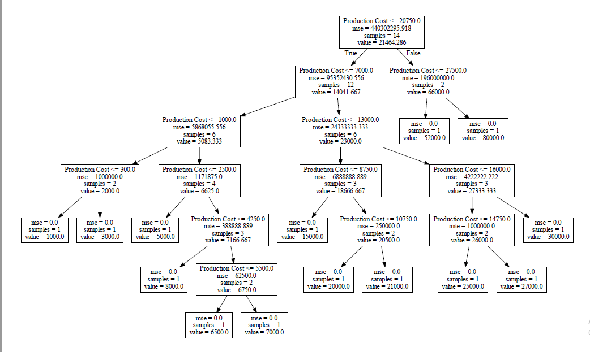

The decision tree is the simplest, yet the most powerful algorithm in machine learning. Decision tree uses a flow chart like tree structure to predict the output on the basis of input or situation described by a set of properties. It falls under the category of supervised learning in machine learning and works for :

- Categorical output problem
- Continuous output problems



In a decision tree we have:

- Nodes, which represent a condition. On the basis of the condition we go to either left(true) or right(false) child of the node.
- Leaves or end nodes, which represents the output of the algorithm.

## Decision Tree Regression

We are focusing on decision tree regression only. So, decision tree regression is used for the continuous output problem. Continuous output means the output of the result is not discrete, i.e., it is not represented just by a discrete, known set of numbers or values. Decision tree regression observes features of an object and trains a model in the structure of a tree to predict data in the future to produce meaningful continuous output.

### Implementation

Now, let's see the implementation of decision tree regression.
```
# import numpy package for arrays and stuff 
import numpy as np
# import matplotlib.pyplot for plotting our result 
import matplotlib.pyplot as plt
# import pandas for importing csv files 
import pandas as pd
```

Here, we are taking a simple and small dataset so as to see and visualize the decision tree easily.

```
# import dataset
# dataset = pd.read_csv('Data.csv')
# alternatively open up .csv file to read data
dataset = np.array(
  [['Asset Flip', 100, 1000],
  ['Text Based', 500, 3000],
  ['Visual Novel', 1500, 5000],
  ['2D Pixel Art', 3500, 8000],
  ['2D Vector Art', 5000, 6500],
  ['Strategy', 6000, 7000],
  ['First Person Shooter', 8000, 15000],
  ['Simulator', 9500, 20000],
  ['Racing', 12000, 21000],
  ['RPG', 14000, 25000],
  ['Sandbox', 15500, 27000],
  ['Open-World', 16500, 30000],
  ['MMOFPS', 25000, 52000],
  ['MMORPG', 30000, 80000]
])
# print the dataset
print(dataset)
```

_[[‘Asset Flip’ ‘100’ ‘1000’]
[‘Text Based’ ‘500’ ‘3000’]
[‘Visual Novel’ ‘1500’ ‘5000’]
[‘2D Pixel Art’ ‘3500’ ‘8000’]
[‘2D Vector Art’ ‘5000’ ‘6500’]
[‘Strategy’ ‘6000’ ‘7000’]
[‘First Person Shooter’ ‘8000’ ‘15000’]
[‘Simulator’ ‘9500’ ‘20000’]
[‘Racing’ ‘12000’ ‘21000’]
[‘RPG’ ‘14000’ ‘25000’]
[‘Sandbox’ ‘15500’ ‘27000’]
[‘Open-World’ ‘16500’ ‘30000’]
[‘MMOFPS’ ‘25000’ ‘52000’]
[‘MMORPG’ ‘30000’ ‘80000’]]_

```
# select all rows by : and column 1 
# by 1:2 representing features 

X = dataset[:, 1:2].astype(int)
# print X 
print(X)
```

_array([[ 100],
[ 500],
[ 1500],
[ 3500],
[ 5000],
[ 6000],
[ 8000],
[ 9500],
[12000],
[14000],
[15500],
[16500],
[25000],
[30000]])_

x will be a 2d array with only one feature, as algorithm needs a 2d array of features.

```
# select all rows by : and column 2 
# by 2 to Y representing labels 
y = dataset[:, 2].astype(int)
# print y 
print(y)
```

_array([ 1000, 3000, 5000, 8000, 6500, 7000, 15000, 20000, 21000,
25000, 27000, 30000, 52000, 80000])_

```
# import the regressor 
from sklearn.tree import DecisionTreeRegressor
# create a regressor object 
regressor = DecisionTreeRegressor(random_state = 0)
# fit the regressor with X and Y data 
regressor.fit(X, y)
```

_DecisionTreeRegressor(criterion=’mse’, max_depth=None, max_features=None,
max_leaf_nodes=None, min_impurity_decrease=0.0,
min_impurity_split=None, min_samples_leaf=1,
min_samples_split=2, min_weight_fraction_leaf=0.0,
presort=False, random_state=0, splitter=’best’)_

Here, the algorithm takes the default values of the parameters. We can change these parameters according to the conditions.

```# predicting a new value
# test the output by changing values, like 3750 
y_pred = regressor.predict(3750)
# print the predicted price 
print("Predicted price: % d\n"% y_pred)
```

_Predicted price: 8000_

```
# export the decision tree to a tree.dot file 
# for visualizing the plot easily anywhere 
import pydotplus
dot_data = export_graphviz(regressor, out_file=None,
                          feature_names=['Production Cost'])'
# using the graph_from_dot_data to visualize the tree formed by the regressor
graph = pydotplus.graph_from_dot_data(dot_data)
graph.write_pdf("tree.pdf")
```

Here, we are graph_from_dot_data function, which takes the dot data file and convert the data into a tree in the form of pdf which is easy to visualize.

So my tree looks like this:



Each node contains four fields, let's see them one by one:


- **Production Cost <= 20750.0 :** This field is the condition on which every node is splitting and on the basis of its result we will decide the child of the node on which we have to proceed.
- **mse = 440302295.918 :** Mse stands for mean square error. It the basis to decide the value for the condition of each node. The one with the highest mse is taken on the root node.
- **samples = 14 :** This field tells the number of samples in each node. As we can observe that the root node consists of all 14 samples, each node is the sum of their child and each leaf node has only one sample which tells the algorithm that it is the leaf node or the output node.
- **value = 21464.286 :** This field is used in the leaf node. This field is the output of the algorithm. We will see the value of the leaf node on which we have reached to find the output.

This covers the basics of Decision Tree Regression and after reading this article you should be good to start using decision tree regression in your next project.
